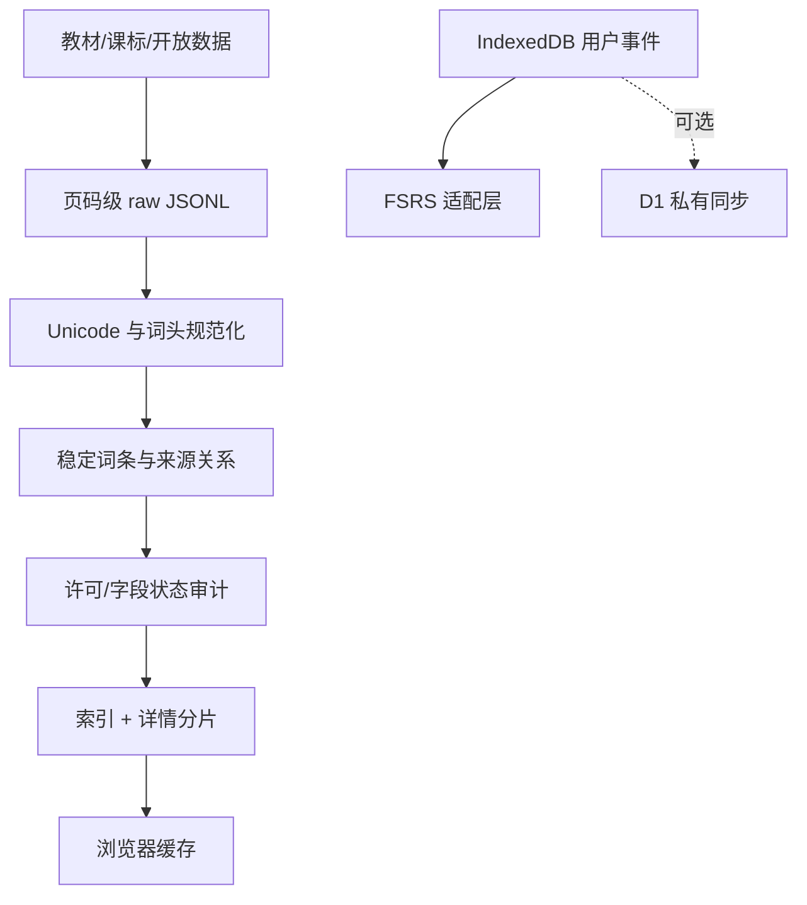

# 数据模型与流水线

## 分离原则

正式词库是版本化静态资产；用户学习状态是本地 IndexedDB 数据，可选同步到 D1。D1 不复制每个用户的一份词库，R2 当前未启用。

## 来源记录

`source_manifest.json` 记录文件级证据：ID、标题、路径、SHA-256、页数、出版社、册次、取得时间、来源 URL、解析方法、版本状态、权利状态和已知问题。`data/build/raw/*.jsonl` 每行保留：

- `sourceRecordId`, `bookId`, `scope`, `volume`, `unit`
- `physicalPage`, `printedPage`, `extraction`, `rawText`
- `headword`, `lookup`, `kind`, IPA/POS/中文候选
- 字段级 `fieldStatus`

`data/build/normalized/*.jsonl` 增加 `stableSourceHash` 和 `normalizationStatus`，可从发布词条的 `sources[].recordId` 追溯回来。

## 发布词条 `LexiconDetail`

| 字段 | 说明 |
|---|---|
| `id` | `pep-` + `kind:lookup` 的 SHA-256 前 16 位；大小写/Unicode 规范化后稳定 |
| `schemaVersion` | 当前 `1.0.0` |
| `headword`, `lookup`, `kind` | 展示词头、搜索键、word/phrase/proper-name |
| `tier` | 高中 A、高价值 B、初中 C |
| `scopes` | 初中核心、高中必修、高中选择性必修、课标差集等，可多值 |
| `variants`, `britishIpa`, `americanIpa` | 拼写变体和英美音标 |
| `pronunciation` | 当前只含 `system-tts`，不冒充真人音频 |
| `partsOfSpeech`, `grammar` | 词性、可数性、及物性 |
| `chineseCore`, `englishCore` | 核心中/英文义；缺口保留 `null`，不可模型补写后直接发布 |
| `openExample` | 只使用开放来源实例；当前不捆绑教材长语境 |
| `sources` | 跨册、单元、页码和课标层级关系 |
| `relations` | 词族、短语、易混关系；每字段有独立审核状态 |
| `license`, `fieldStatus`, `flags` | 权利、审核证据和发布资格 |

索引只包含搜索/筛选所需字段；详情按 180 条切片，避免首屏加载全部释义和关系。

## 用户数据

IndexedDB：`pep-vocab-studio`，版本 2；用户数据 schema `1.1.0`。

- `cards`：每词一个 `StoredCard`；FSRS 序列化状态、六项能力、状态、到期时间、收藏/注释/标签。
- `events`：追加式 `ReviewEvent`；UTC、当地日期、时区、题型、题目、实际作答、期望答案、来源行、能力、评分、正误、反应时间、提示、错误类型、调度前后间隔/稳定度/难度、完整卡片快照和 scheduler log。
- `lists`：自定义词单。
- `settings`：每日时间、目标保持率、教材范围、模式、主题、AI 开关、诊断状态、考试日期。
- `meta`：schema 与迁移元数据。

撤销不会删除原事件，而是追加 `eventType: undo` 并指向 `targetEventId`；分析与重放时排除已撤销事件。

`1.0.0` JSON 备份恢复前会确定性迁移为 `1.1.0`，补入新增证据字段并合并当前设置默认值；未知 schema 仍在写入前拒绝。

个人文章保存在独立 IndexedDB `pep-vocab-personal-readings`（版本 1）的 `index` 与 `articles` 表，可逐篇导出 Markdown；不包含在学习备份与 D1 快照中。

## D1 同步

`sync_states(user_key, revision, schema_version, payload, client_updated_at, server_updated_at)`。`user_key` 是站点身份邮箱的 SHA-256；payload 上限 5 MB；服务端同时校验请求与备份 payload 的 schema。客户端提交 `baseRevision`，不一致返回 HTTP 409，禁止静默覆盖。

## AI 接口配置

`ai_configs` 与学习备份分表存放，只保存以下服务端配置：

- 站点身份的 SHA-256 键；
- DeepSeek 或 OpenAI-compatible 服务商、经安全校验的 HTTPS Base URL、模型、每日调用上限和超时；
- API Key 的 AES-GCM 密文、随机 96-bit IV 与加密版本。

AES 主密钥来自 Sites Secret `AI_CONFIG_ENCRYPTION_KEY`，不进入 D1、客户端、构建产物或 Git。GET 接口只返回 `hasApiKey` 等非敏感状态，不返回密文、IV、Key 尾号或明文。写入和删除要求同源请求、自定义动作头与已认证站点身份；更换服务商或规范化 Base URL 时必须重新提交 API Key，禁止把已保存密钥转发到新目标。

`ai_rate_limits` 只保存身份摘要与时间窗口组成的桶键、计数和过期时间。四类词条助手接口及阅读分类接口按分钟和每日双重限流，模型请求和响应正文受共同超时与增量大小限制。连通测试使用最小 Chat Completions 请求，只返回耗时、服务商和模型状态，不回显模型正文或上游错误正文。

## 审核状态

允许值：`verified-primary`、`verified-cross-source`、`editorial-reviewed`、`provisional`、`conflicted`、`rejected`。模型生成内容只能是 `provisional`。发布审计不允许 `unknown` 或 `prohibited` 权利内容。
